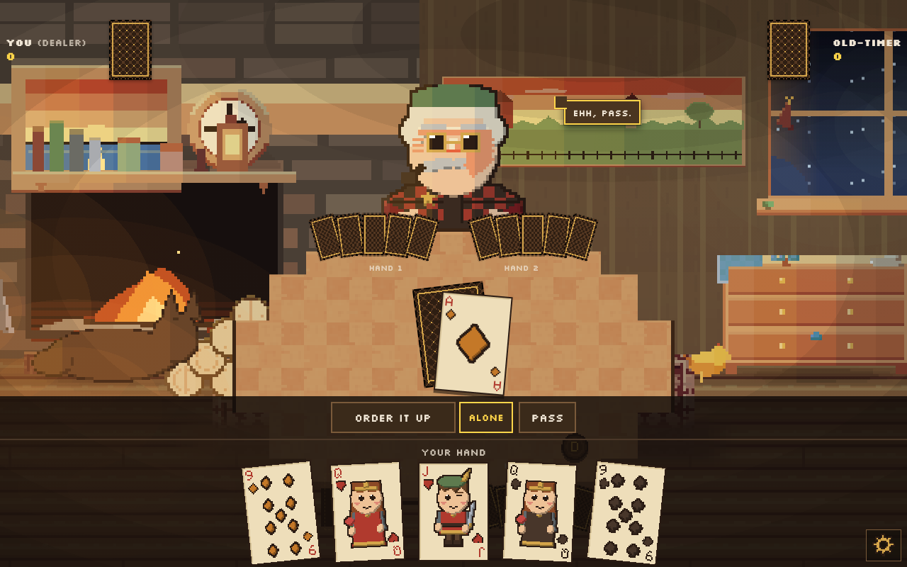
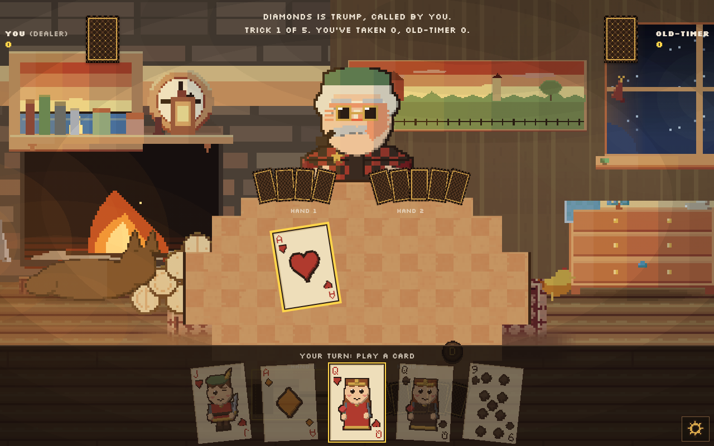
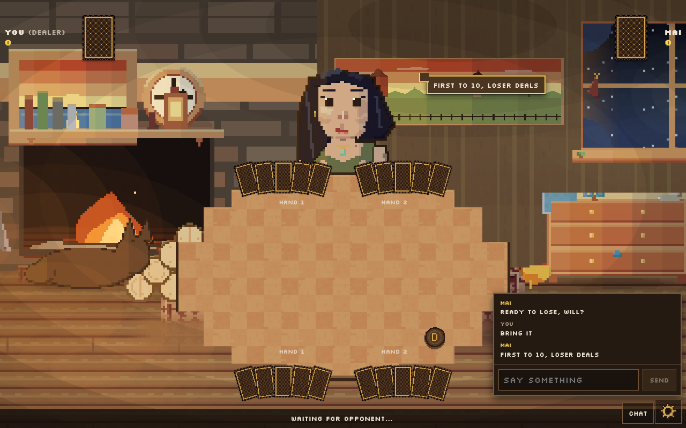
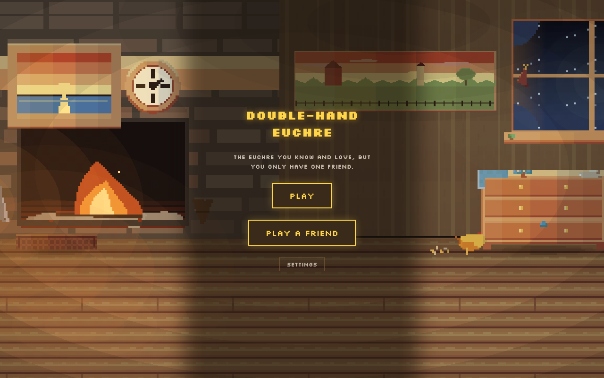
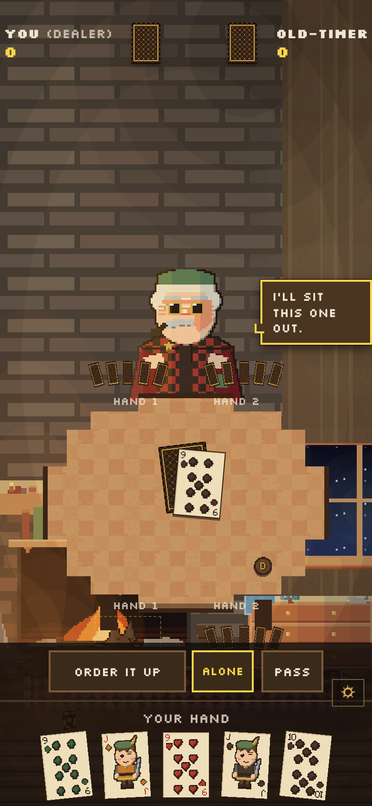
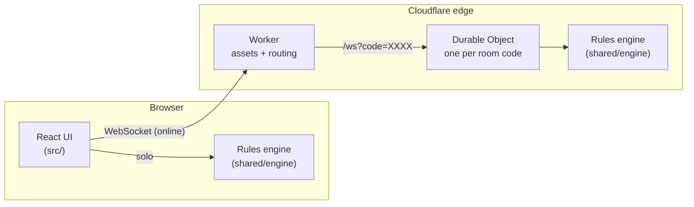

# Double-Hand Euchre

*The euchre you know and love, but you only have one friend.*

[](https://github.com/WillPaz16/two-handed-euchre/actions/workflows/ci.yml)

**▶ Play it: [doublehand.willpaz16.workers.dev](https://doublehand.willpaz16.workers.dev)**, solo against a bot or online with a friend.

A pixel-art cabin, a crackling fire, and a variant of euchre we invented so two people can play
the four-handed game. Each of you plays **both** hands of a partnership: one you picked without
looking, and one you only see when it's that hand's turn.



## How it plays

Standard 24-card euchre, first to 10, with two twists that change everything:

- **You play both seats of your partnership.** Four hands are dealt, two each. Every trick has
  four cards, and two of them are yours.
- **You pick your hand blind.** Before anyone looks, you choose which of your two hands to pick
  up. You see the other one only on its own turn, never both at once, so you're juggling two
  hands from memory.
- **A loner ladder that rewards nerve.** Go alone the normal way for 4 points, or, as optional
  house rules, commit *before* looking at your hand (6) or before even seeing trump (8).

The [established two-handed variants](https://en.wikipedia.org/wiki/Euchre_variants) deal one
playable hand per player, so this isn't one of them. The full spec is in [RULES.md](RULES.md).

## Features

- **Solo play** against a heuristic bot with a face: expressions and speech bubbles that react to
  how the hand is going, and four characters to choose from.
- **Online multiplayer** by four-letter room code, with reconnect-to-your-seat, typed chat that
  pops up in your opponent's speech bubble, and a turn indicator while you wait.
- **Rules you agree on.** If your settings differ, both players choose before the first deal.
  A mid-game rule change is a proposal the other player accepts, and it starts next hand.
- **Installable and offline.** It's a PWA: add it to a home screen, and solo play works with no
  network.
- **Every screen size**, from a 300px phone to an ultrawide monitor, with whole-pixel art scaling.

<table>
  <tr>
    <td width="50%"></td>
    <td width="50%"></td>
  </tr>
  <tr>
    <td width="50%"></td>
    <td width="50%" align="center"></td>
  </tr>
</table>

## How it's built



**One rules engine, two homes.** `shared/engine` is a pure TypeScript reducer with no DOM and no
network, seeded so every deal is reproducible. Solo play runs it in the browser; online play runs
the *same code* on the server, so the two modes can't disagree about the rules.

**The server is authoritative.** Clients send intentions. The room checks each one against the
engine's legal moves for *that connection's* seat, and sends every player a view redacted for
their eyes only. A modified client can't see hidden cards or play out of turn, because the move
simply isn't in its legal list.

**One Durable Object per room.** The room code *is* the object's identity, so Cloudflare
guarantees exactly one instance of each game worldwide: no single server to outgrow and no
split-brain. Sockets use the Hibernation API, so an idle game costs nothing, and the whole thing
runs on Cloudflare's free tier.

**Art and audio are generated by code.** Every card, character, and piece of the cabin is drawn
by a deterministic Python generator ([`art/generate_art.py`](art/generate_art.py)), and every
sound is synthesized from waveform math ([`art/generate_audio.py`](art/generate_audio.py)). There
are no hand-painted or model-generated asset files, and regenerating is pixel-identical.

## Quality gates

Every pull request and every push to `dev` or `main` runs these in CI. Nothing deploys unless all
of them pass.

| Check | What it guards |
|---|---|
| 189 unit & component tests (Vitest) | rules, scoring, room logic, multiplayer protocol, UI behavior |
| 10,000-deal fuzz | random legal play under random rule settings never reaches an illegal state |
| Layout audit (Playwright) | 11 screen sizes: whole-pixel art scaling, UI/scenery collisions, edge anchoring, hand-fan spacing |
| Art checks | two generator runs are pixel-identical, card art is unchanged, sprites have no holes |
| Production build | the app and the Worker both type-check and build |

## Tech stack

| | |
|---|---|
| Client | React 19, TypeScript, Vite, vite-plugin-pwa |
| Server | Cloudflare Workers, Durable Objects (SQLite storage), Hibernatable WebSockets |
| Testing | Vitest, Testing Library, Playwright |
| Assets | Python + Pillow (sprites), stdlib `wave` (audio) |
| CI/CD | GitHub Actions → Wrangler; `dev` and `main` deploy to separate staging and production Workers |

## Running it locally

Requires Node 22+.

```bash
npm install
npm run dev        # the game with hot reload, http://localhost:5173
npm run worker     # multiplayer server on :8787 (run `npm run build` once first)
```

Solo play needs only `npm run dev`. Other useful scripts:

```bash
npm test           # unit and component tests
npm run fuzz       # 10,000 random deals
npm run audit      # layout audit across 11 screen sizes
npm run typecheck && npm run typecheck:worker
```

To regenerate art or audio (Python 3.11+):

```bash
pip install -r art/requirements.txt
python3 art/generate_art.py && npm run art:check
python3 art/generate_audio.py
```

When editing the characters, `python3 art/check_avatar_posture.py` compares the sprites against
the last commit.

## Project layout

```
src/            React app: screens, table, hooks, styles
shared/engine/  pure rules engine (deal, bidding, loners, tricks, scoring, redaction)
shared/net/     room logic and wire protocol, shared by client and server
shared/bot/     the solo opponent
worker/         Cloudflare Worker and the per-room Durable Object
tests/          Vitest suite
scripts/        fuzz, layout audit, multiplayer smoke test, bot balance
art/            asset generators, checks, and the art spec (ASSETS.md)
public/         generated sprites and audio
docs/           README screenshots
```

## Deploying

Pushing to `dev` deploys the staging site, and merging to `main` deploys production, both only
after every check passes. Environments, setup, and manual deploys are in [DEPLOY.md](DEPLOY.md).
